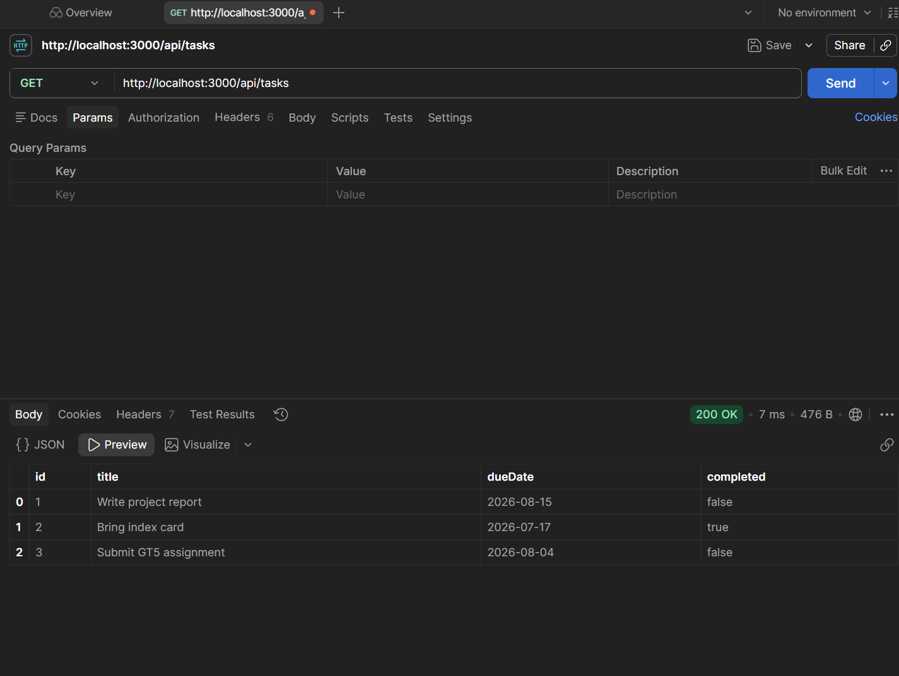
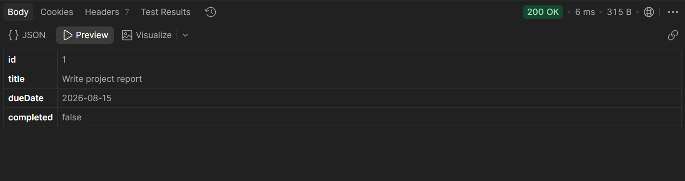
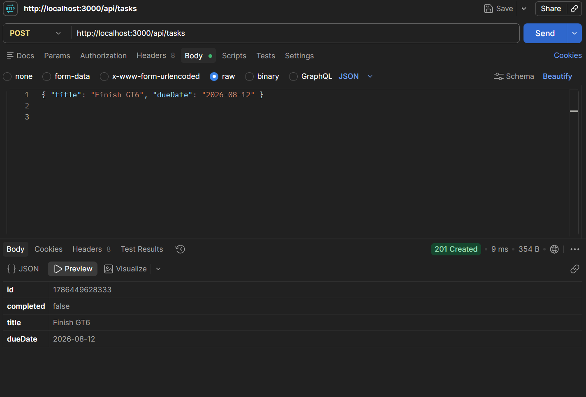
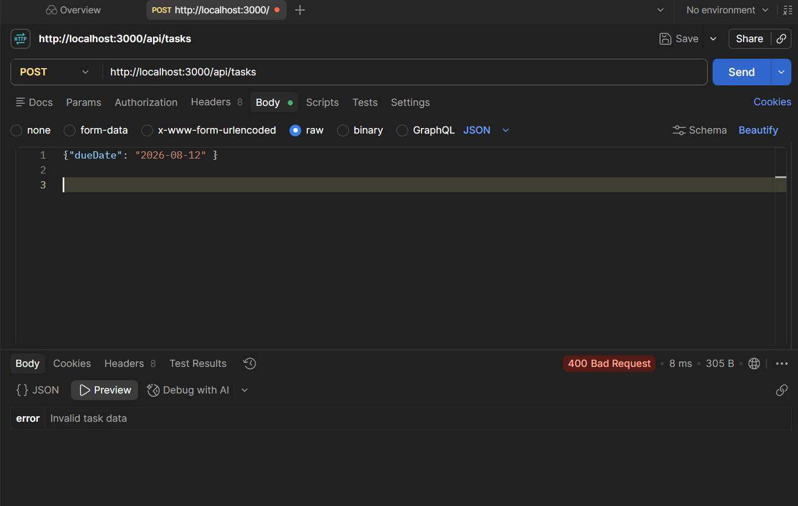
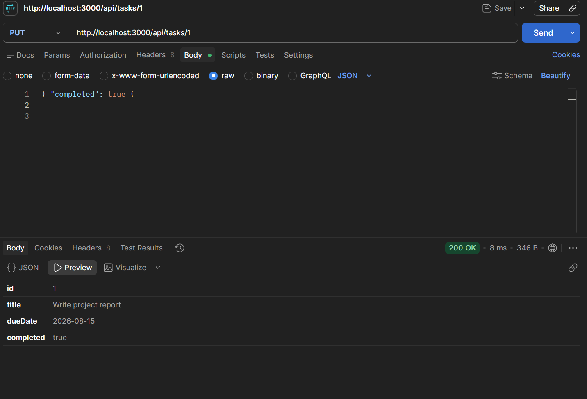
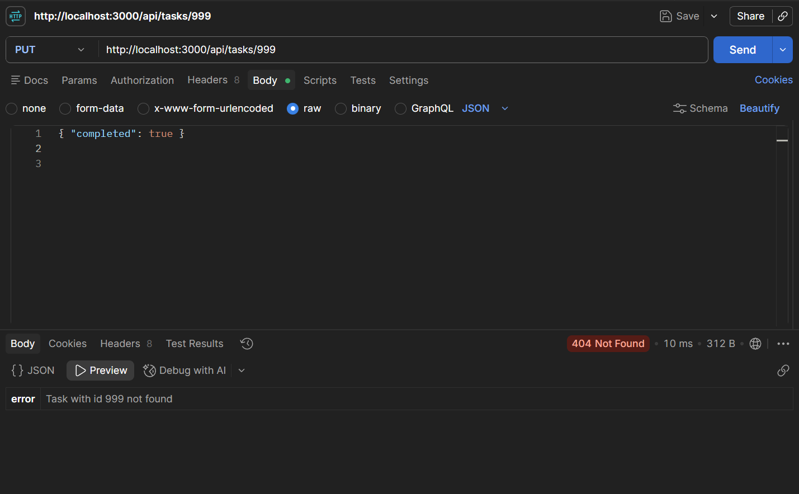
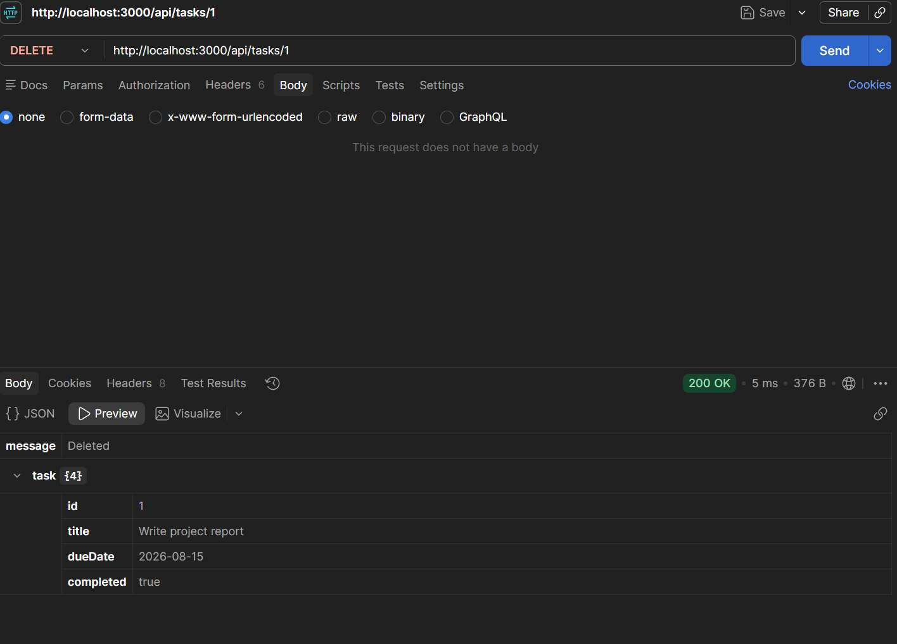

# itelect2-project
My IT Elective 2 backend web development project.

Author: Erika Trixie P. Dirilo

## API TESTING

1. ***GET***

2. ***POST***
successful post

missing title

3. ***PUT***

Unknown ID

4. ***DELETE***

